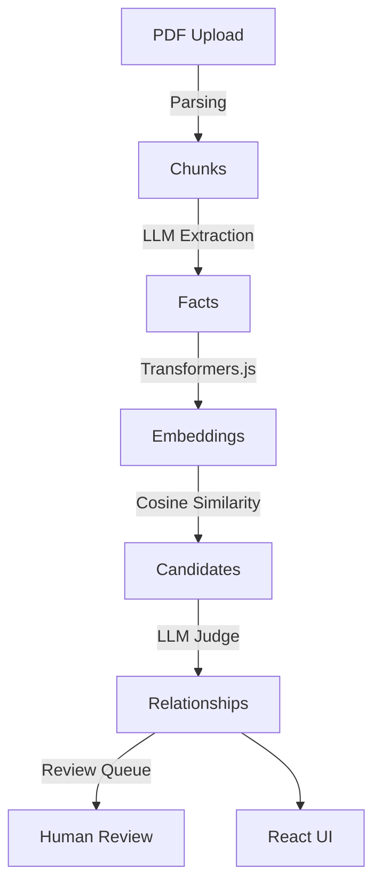

# Fact Knowledge Layer (FKL)

A local-first system that extracts grounded financial facts from PDFs, embeds them for semantic search, and uses an LLM judge to detect when facts across documents corroborate, contradict, or are reconciled by context.

## Architecture



## Tech Stack
- **Backend**: Node.js, Express, TypeScript, better-sqlite3
- **Embeddings**: `@xenova/transformers` (`all-MiniLM-L6-v2`) running locally
- **LLM**: Groq (`groq/compound`) / Gemini API (`gemini-2.5-flash`)
- **Frontend**: React, Vite, Vanilla CSS

## Setup and Running

1. **Install Dependencies**
   ```bash
   cd server && npm install
   cd ../client && npm install
   ```

2. **Environment Variables**
   Create a `.env` file in the `server/` directory:
   ```env
   GROQ_API_KEY=your_key
   GEMINI_API_KEY=your_key
   ```

3. **Start the Servers**
   In one terminal tab:
   ```bash
   cd server
   npm run dev
   ```
   In another terminal tab:
   ```bash
   cd client
   npm run dev
   ```

## Pipeline Overview

1. **Phase 1 (Parsing)**: PDFs are chunked into paragraphs using `pdfjs-dist`.
2. **Phase 2 (Extraction)**: Chunks are fed into the LLM to extract subjects, attributes, values, and units.
3. **Phase 3 (Embedding)**: Facts are embedded into a local SQLite database using Xenova transformers.
4. **Phase 4 (Judging)**: Cosine similarity identifies candidate fact pairs across documents. An LLM judge decides if they corroborate, contradict, or are reconciled.

## API Endpoints
- `POST /api/documents` (multipart/form-data): Upload a PDF.
- `GET /api/documents`: List processed documents.
- `GET /api/relationships`: Fetch all judged fact relationships.
- `GET /api/documents/:id/evidence/:chunkId`: Get the raw chunk text and bounding box.
