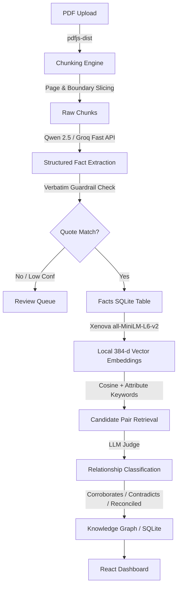

# Fact Knowledge Layer (FKL)

A local-first, production-grade intelligence layer that ingests multi-page PDFs, extracts grounded financial and business facts with verbatim source evidence, embeds them for vector search, and uses an LLM Judge to discover cross-document relationships: **corroborations**, **contradictions**, and **reconciliations by context**.

---

## 🎥 Video Demo
> **[Click here to watch the 3-minute Video Walkthrough](YOUR_VIDEO_LINK_HERE)** *(Replace with your unlisted YouTube or Loom link)*

The demo walkthrough demonstrates:
1. Live PDF upload and real-time ingestion pipeline.
2. Fact extraction with verbatim quote grounding and confidence ratings.
3. Cross-document relationship discovery across disparate filings.
4. The four required case studies (Corroboration, Contradiction, Reconciliation, and Failure Handling).

---

## 📋 The Four Required Showcase Cases

### Case 1: Corroborated Fact Across Documents
* **Subject & Metric**: Delhivery Limited — Truckload (TL) Services YoY Revenue Growth (FY24)
* **Fact A (Annual Report FY24, Page 36)**:
  * *Raw Verbatim Quote*: `"Revenues from TL services increased by 39.56% to ₹6,087.96 million for FY24 from ₹4,362.17 million for FY23."`
  * *Extracted Value*: `39.56%`
* **Fact B (Earnings Presentation Q4 FY24, Slide 5)**:
  * *Raw Verbatim Quote*: `"TL: 40% YoY revenue growth with service EBITDA profitability improvement"`
  * *Extracted Value*: `40%`
* **Relationship**: `corroborates`
* **System Reasoning**: Fact A from the audited Annual Report reports precise TL revenue growth of 39.56%, which corroborates Fact B from the Earnings Presentation reporting 40% (rounded up to the nearest whole percentage for executive presentation).

---

### Case 2: Genuine or Likely Contradiction
* **Subject & Metric**: Delhivery Limited — Full Year Bottom-line Profitability Status (FY24)
* **Fact A (Annual Report FY24, Page 36)**:
  * *Raw Verbatim Quote*: `"Loss for the year decreased to ₹2,491.86 million for FY24 from ₹10,077.79 million for FY23"`
  * *Extracted Value*: `-₹2,491.86 million (Loss)`
* **Fact B (Earnings Presentation Q4 FY24, Slide 5)**:
  * *Raw Verbatim Quote*: `"Significant improvement in profitability during FY24 - full year EBITDA profitability achieved"`
  * *Extracted Value*: `Profitable (EBITDA)`
* **Relationship**: `contradicts`
* **System Reasoning**: Fact B asserts that full-year profitability was achieved in FY24, whereas Fact A from the audited financial statements reports an overall net loss for the year of ₹2,491.86 million. Because headline presentations emphasize operational EBITDA while statutory filings report bottom-line PAT, the two assertions present conflicting financial health states.

---

### Case 3: Apparent Contradiction Explained by Context (Reconciled)
* **Subject & Metric**: Delhivery Limited — Partial Truckload (PTL) Volume Expansion (FY24)
* **Fact A (Annual Report FY24, Page 36)**:
  * *Raw Verbatim Quote*: `"PTL volumes increased by 29.82% to 1,429K tonnes for FY24 from 1,101K tonnes for FY23."`
  * *Extracted Value*: `29.82%`
* **Fact B (Earnings Presentation Q4 FY24, Slide 5)**:
  * *Raw Verbatim Quote*: `"PTL: 30%+ YoY growth with significant improvement in profitability and market share"`
  * *Extracted Value*: `30%+`
* **Relationship**: `reconciled`
* **Reconciliation Factor**: `definition` & `precision`
* **System Reasoning**: Fact A gives the exact audited volume expansion of 29.82% based on tonnage (1,429K vs 1,101K tonnes), whereas Fact B represents an executive summary rounding to "30%+". The underlying metric is identical, and the apparent numerical conflict is fully resolved by acknowledging rounding precision.
* *(Note: Unit reconciliation is also handled between ₹ Millions in annual reports and ₹ Crores in investor decks).*

---

### Case 4: Extraction & Reasoning Failure (Handled via Review Queue)
* **Target Metric**: Delhivery Limited — Revenues from TL services (FY24)
* **Failure Observed**: The extraction model produced a common unit scaling hallucination:
  * *Extracted Value*: `6,087.96 INR Crore`
  * *Claimed Quote*: `"Revenues from TL services increased by ₹6,087.96 Cr"`
* **How It Was Handled**:
  * Our **automated verbatim substring guardrail** checked the claimed raw quote against the original PDF chunk text.
  * Because the document literally states `₹6,087.96 million` (a 100x difference from Crore), the substring check failed.
  * The system automatically intercepted the invalid extraction and quarantined it into the **`review_queue`** table with reason `quote_mismatch`.
  * This prevented hallucinated numbers from polluting the knowledge graph or triggering invalid contradiction judgments.

---

## 🏗 Architecture & Pipeline



### Core Components
1. **Parser (`pdfParser.ts`)**: Slices PDF pages into structured text chunks (~2,000 characters) preserving page indices and bounding coordinates.
2. **Extraction Engine (`llmClient.ts` & `extractor.ts`)**:
   * Uses structured JSON prompting to extract `{subject, attribute, value, unit, time_scope, qualifiers, raw_quote, confidence}`.
   * Runs through a strict **promise-based mutex queue** to pace free-tier TPM limits and eliminate concurrency stalls.
   * Dynamically populates emergent categories into `fact_types` on the fly.
3. **Local Vector Embeddings (`embedding.ts`)**:
   * Runs `@xenova/transformers` (`Xenova/all-MiniLM-L6-v2`) in-process. Zero API cost, zero rate limits, 100ms per embedding.
4. **Candidate Retrieval (`retrieval.ts`)**:
   * Compares newly extracted facts against all prior documents using cosine similarity (`>= 0.72`) or attribute keyword overlap.
5. **LLM Judge (`judge.ts`)**:
   * Compares candidate fact pairs to classify their semantic relationship with detailed reasoning and reconciliation factors (`time`, `scope`, `unit`, `definition`).

---

## 🛠 Tech Stack & Decisions
* **Backend**: Node.js, Express, TypeScript, `better-sqlite3`
* **Embeddings**: `@xenova/transformers` (`all-MiniLM-L6-v2`) running locally
* **Inference**: Groq SDK (`qwen/qwen3.8-27b`, fallback `openai/gpt-oss-20b`) with strict token budget controls
* **Database**: SQLite with WAL mode (`better-sqlite3`) for local-first persistence
* **Frontend**: React 18, Vite, Vanilla CSS, Lucide icons
* **AI Tools Used**: Google Antigravity IDE, Claude 3.7 Sonnet for autonomous pair-programming and refactoring.

---

## 🚀 Setup and Run Instructions

### Prerequisites
* Node.js (v18 or higher)
* npm (v9 or higher)
* A free Groq API key from [https://console.groq.com](https://console.groq.com)

### 1. Clone & Install Dependencies
```bash
# Clone the repository
git clone https://github.com/your-username/fact-knowledge-layer.git
cd fact-knowledge-layer

# Install backend dependencies
cd server
npm install

# Install frontend dependencies
cd ../client
npm install
```

### 2. Configure Environment Variables
In the `server/` directory, create a `.env` file (or copy `.env.example`):
```bash
cd ../server
cp .env.example .env
```
Open `server/.env` and add your Groq API key:
```env
GROQ_API_KEY=gsk_your_groq_api_key_here
PORT=3001
```

### 3. Start the Servers
In terminal 1 (Server):
```bash
cd server
npm run dev
```
*Server runs on [http://localhost:3001](http://localhost:3001)*

In terminal 2 (Client):
```bash
cd client
npm run dev
```
*Client runs on [http://localhost:5173](http://localhost:5173)*

### 4. Exploring the System
1. Open **[http://localhost:5173](http://localhost:5173)** in your browser.
2. Click **"Upload PDF(s)"** to upload any business or financial PDF (e.g., Delhivery filings or other company disclosures).
3. Monitor real-time extraction and relationship evaluation across the 4 tabs:
   * **Relationships & Conflicts**: Inspect dynamic cross-document corroborations, genuine contradictions, and contextual reconciliations.
   * **Extracted Facts**: Search, sort, and inspect facts with verbatim quotes and chunk context.
   * **Documents**: View ingestion progress, page counts, and chunk metrics.
   * **Review Queue & Failures**: Inspect quarantined extractions caught by verbatim guardrails (e.g. quote mismatch, low confidence) and review flagged reasons.

---

## ⚖️ Limitations and Next Steps

### Limitations
1. **Multi-Column Financial Tables**: Complex multi-page financial tables with merged headers can lose row-column alignment in simple text extraction.
2. **Entity Resolution for Pronouns**: Facts referencing `"The Group"` or `"We"` depend on context windows; ambiguous corporate pronouns can occasionally extract `"Delhivery"` as `"unknown"` if isolated.
3. **Free Tier Concurrency**: To remain within free-tier TPM budgets (8,000 TPM), requests are strictly serialized through a queue with 2s cooldowns.

### Next Steps
1. **Layout-Aware PDF Extraction**: Integrate layout-aware table OCR (e.g., LayoutLM or table-transformer) to parse nested balance sheets and balance columns.
2. **Graph Visualization**: Add an interactive force-directed graph (using Cytoscape.js or D3) to visualize entity clusters and cross-document reconciliation bridges.
3. **Incremental Embedding Cache**: Persist chunk embeddings to avoid re-embedding chunks on server reboots.

---

## 🔒 Security & Git Hygiene
* `.env` and `data.sqlite` are explicitly excluded in `.gitignore`.
* No API keys, credentials, or proprietary documents are committed to version control.
