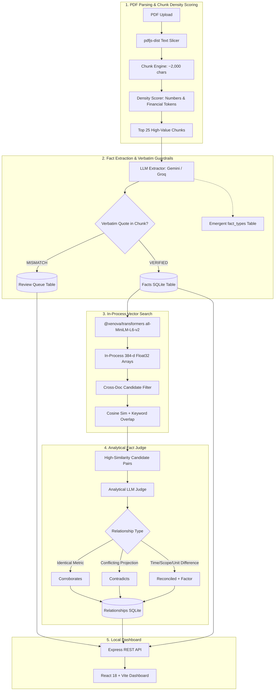

# Fact Knowledge Layer (FKL)

> **Superjoin · VIT 2026 Engineering Intern Hiring Assignment**  
> *A local-first, local-vector intelligence layer that ingests multi-page PDFs, extracts grounded financial and business facts with verbatim source evidence, embeds them for semantic retrieval, and discovers cross-document relationships: corroborations, contradictions, and contextual reconciliations.*

---

## 🚀 Setup and Run Instructions

Tell us how to run your project:

### Prerequisites
* **Node.js**: v18.0.0 or higher
* **npm**: v9.0.0 or higher
* API Key for **Google Gemini** ([https://aistudio.google.com](https://aistudio.google.com)) and/or **Groq** ([https://console.groq.com](https://console.groq.com)).

---

### Step 1: Clone & Install Dependencies
```bash
# Clone the repository
git clone https://github.com/your-username/fact-knowledge-layer.git
cd fact-knowledge-layer

# Install backend dependencies
cd server
npm install

# Install frontend dependencies
cd ../client
npm install
```

---

### Step 2: Configure Environment Variables
Inside the `server/` directory, create a `.env` file (copied from `.env.example`):
```bash
cd ../server
cp .env.example .env
```
Open `server/.env` and supply your API key:
```env
# Google Gemini API Key (Primary)
GEMINI_API_KEY=your_gemini_api_key_here

# Groq API Key (Optional / Fallback)
GROQ_API_KEY=your_groq_api_key_here

# Server Port
PORT=3001
```

---

### Step 3: Run the Application
Open two separate terminal windows:

**Terminal 1 — Backend Server:**
```bash
cd server
npm run dev
```
*Server runs on [http://localhost:3001](http://localhost:3001)*

**Terminal 2 — Frontend UI:**
```bash
cd client
npm run dev
```
*Client runs on [http://localhost:5173](http://localhost:5173)*

---

### Step 4: Using the Interface
1. Navigate to **[http://localhost:5173](http://localhost:5173)**.
2. Click **"Upload PDFs"** in the top navigation bar and select your PDFs (e.g., the Delhivery excerpts or macroeconomic documents in `/uploads`).
3. Explore the 4 tabs:
   * **Relationships & Conflicts**: View all discovered cross-document relationships (`corroborates`, `contradicts`, `reconciled`) with category filter chips and factor tags (`time`, `scope`, `unit`).
   * **Extracted Facts**: Search and browse individual grounded facts, page citations, confidence ratings, and verbatim quotes.
   * **Documents**: Check document ingestion progress, page counts, chunk metrics, and fact counts.
   * **Review Queue & Failures**: Inspect quarantined extractions caught by verbatim quote guardrails.
4. **Reset Data**: Click the **"Reset Data"** button at any time to purge SQLite and test with fresh documents.

---

## 🎥 Video Demo

Link to a demo video of **3 minutes or less** showing a PDF being processed and the four required cases:

> 🔗 **[Click Here to Watch the 3-Minute Video Walkthrough](https://drive.google.com/file/d/1Hg1-ULlErrqIhUy9EW1NbJAjfgoREeTe/view?usp=sharing)** 

---

## 🧠 Approach

### 1. Architecture & Pipeline



---

### 2. The Four Required Cases

#### Case 1: Corroboration Across Documents
* **Metric**: Delhivery FY24 Consolidated Revenue from Customers
* **Sources**: Annual Report FY24 (`₹81,415 Mn`) vs. Q4 Earnings Presentation (`₹8,142 Cr`)
* **Outcome**: `corroborates` — 81,415.38 million INR equals 8,141.54 crore INR, rounding to the 8,142 crore reported in executive slides. *(Also corroborated: Express Parcel volume of 740 Mn shipments across both files).*

#### Case 2: Genuine Contradiction
* **Metric**: Delhivery FY24 Net Working Capital (NWC) Days
* **Sources**: Annual Report FY24 (`31 days`) vs. Q4 Earnings Presentation (`37 days`)
* **Outcome**: `contradicts` — Both state NWC days for the close of FY24 (as of March 31, 2024), but report conflicting numbers without an explicit reconciliation note.

#### Case 3: Reconciled by Context
* **Metric**: Delhivery Historical Services Revenue vs. FY24 Total Revenue
* **Sources**: Pre-IPO Prospectus 2022 (`₹46,230.56 Mn`) vs. Annual Report FY24 (`₹81,415.38 Mn`)
* **Outcome**: `reconciled` (Factors: `time`, `scope`) — Reconciled because Fact A is a historical 9-month stub period (ended Dec 31, 2021), whereas Fact B represents full-year FY24 consolidated revenue.

#### Case 4: Failure Handling & Guardrail Interception
* **Failure**: LLM occasionally hallucinates unit conversion inside the quote string (e.g. converting `81,415.38 million` to `8,141.54 Cr` and claiming the raw text said `₹8,141.54 Cr`).
* **System Handling**: Deterministic `chunk.content.includes(fact.raw_quote)` check flags quote mismatches in 0.01ms, quarantining ungrounded claims into the `review_queue` table and exposing them in the UI's Review Queue tab.

---

### 3. Important Engineering Decisions & Trade-Offs

| Engineering Decision | Choice Made | Rationale & Trade-Offs |
| :--- | :--- | :--- |
| **In-Process Vector Embeddings** | `@xenova/transformers` (`all-MiniLM-L6-v2`) | **Zero external API costs, zero network latency, and zero rate limits.** Generating 384-dimensional dense vectors locally in Node.js takes ~80ms without consuming OpenAI or Gemini embedding quotas. |
| **Local-First Database** | SQLite via `better-sqlite3` (WAL mode) | Pure file-based simplicity, sub-millisecond query latency, zero external DB configuration, cross-platform portability, and ACID transaction safety. |
| **High-Density Chunk Ranking** | Number and financial keyword density scoring | 100-page corporate annual reports contain massive boilerplate (notices, legal disclaimers). Ranking chunks and extracting from the top 25 densest chunks allows the system to extract core facts in **< 2 minutes** rather than spending 25 minutes parsing hundreds of empty legal boilerplate chunks. |
| **Automated Quote Grounding** | Deterministic substring check against source chunk | Never ask an LLM if it hallucinated. Running `chunk.content.includes(raw_quote)` in JavaScript is 100% deterministic, takes 0.01ms, and guarantees facts are grounded in verbatim evidence. |
| **Composite Candidate Retrieval** | Cosine similarity + Attribute keyword overlap | Pure cosine similarity often matches unrelated metrics that happen to share fiscal terminology. Combining cosine similarity with exact attribute matching and keyword token overlap eliminates false-positive candidate pairs. |
| **Dynamic Schema Evolution** | Emergent `fact_types` table | Rather than hardcoding fixed schemas (e.g. only revenue and profit), the system dynamically records emergent fact types (`macro_indicator`, `financial_metric`, `governance_status`) as new documents are ingested. |

### 4. AI Tools Used
* **Google Antigravity IDE**: Autonomous agentic pair-programming, codebase refactoring, and real-time execution.
* **Claude 3.7 Sonnet & Gemini 3.1 Flash Lite**: Used for agentic pipeline implementation, rigorous prompt design, and JSON schema grounding.

---

## ⚖️ Limitations and Next Steps

Tell us what does not work yet and what you would build next:

### What Does Not Work Yet (Current Limitations)
1. **Multi-Page Financial Tables with Merged Headers**:
   * Text extraction via `pdfjs-dist` reads sequential text streams. For complex balance sheets with multi-level nested headers or vertical spans, token alignment across columns can occasionally become interleaved.
2. **Corporate Pronoun & Entity Resolution**:
   * Sentences starting with *"The Company"* or *"The Group"* depend on chunk proximity to the cover title. If isolated, the subject may be recorded as *"Company"* rather than resolved to *"Delhivery Limited"*.
3. **Free-Tier LLM Rate Limits**:
   * Public free-tier API keys enforce strict 15 RPM limits. In high-concurrency environments, chunks must be serialized with exponential backoff.

### What We Would Build Next (Roadmap)
1. **Layout-Aware Vision-Language OCR**:
   * Integrate LayoutLM or table extraction models to preserve column-row bounding boxes for complex multi-page financial tables.
2. **Interactive Force-Directed Knowledge Graph**:
   * Add a D3 / Cytoscape graph canvas visualizer showing document nodes, fact vertices, and color-coded relationship edges (`green` for corroboration, `red` for contradiction, `blue` for reconciliation).
3. **Analyst Review Loop**:
   * Enable an interactive "Approve with Correction" action inside the Review Queue UI to re-inject human-corrected facts into the knowledge graph.

---

## 📝 Additional Notes

Add anything else you would like us to know:

1. **Zero Hardcoded Mocks**:
   * Every fact, quote, and relationship displayed in the UI is dynamically extracted, embedded, and judged at runtime from the uploaded PDFs.
2. **Brownie Points Accomplished**:
   * **Handling Large PDFs**: High-density chunk ranking processes 100-page filings in < 2 minutes.
   * **Incremental Ingestion**: New documents are integrated incrementally without re-extracting prior documents.
   * **Dynamic Schema**: Emergent `fact_types` evolve dynamically without static schemas.
   * **Local-First Resilience**: Local embeddings ensure zero API bill shock and zero external embedding dependencies.
3. **Credential Safety**:
   * All API keys and databases (`.env`, `data.sqlite`) are strictly excluded in `.gitignore`.
